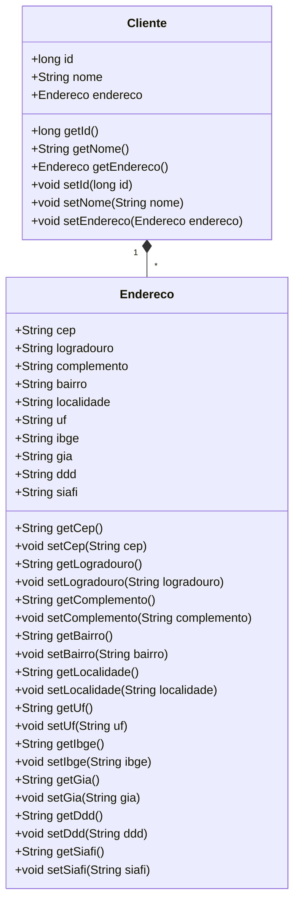

## Diagrama de Classes

```mermaid
classDiagram
    class Cliente {
        +long id
        +String nome
        +Endereco endereco
        +long getId()
        +String getNome()
        +Endereco getEndereco()
        +void setId(long id)
        +void setNome(String nome)
        +void setEndereco(Endereco endereco)
    }

    class Endereco {
        +String cep
        +String logradouro
        +String complemento
        +String bairro
        +String localidade
        +String uf
        +String ibge
        +String gia
        +String ddd
        +String siafi
        +String getCep()
        +void setCep(String cep)
        +String getLogradouro()
        +void setLogradouro(String logradouro)
        +String getComplemento()
        +void setComplemento(String complemento)
        +String getBairro()
        +void setBairro(String bairro)
        +String getLocalidade()
        +void setLocalidade(String localidade)
        +String getUf()
        +void setUf(String uf)
        +String getIbge()
        +void setIbge(String ibge)
        +String getGia()
        +void setGia(String gia)
        +String getDdd()
        +void setDdd(String ddd)
        +String getSiafi()
        +void setSiafi(String siafi)
    }

    Cliente "1" *-- "*" Endereco
```
